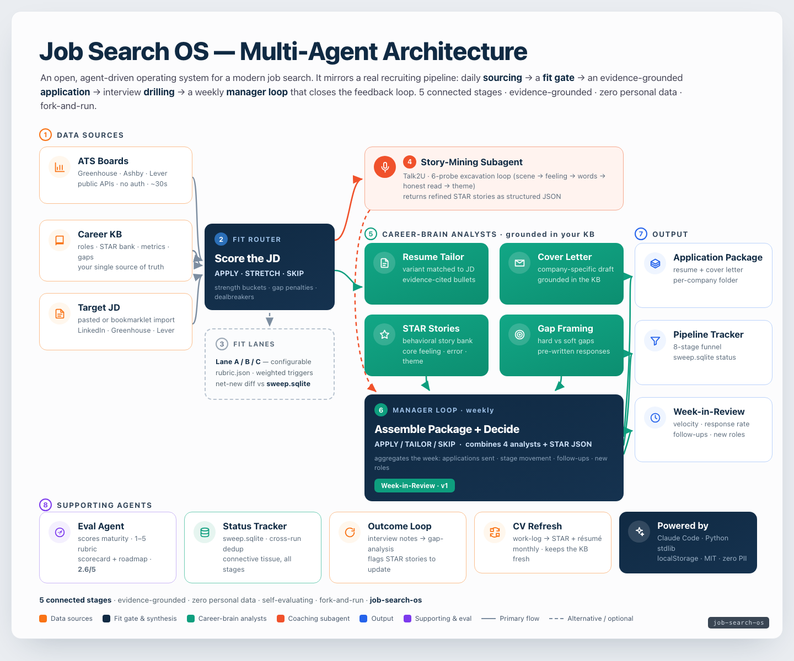

# Job Search OS

An open, agent-driven operating system for a modern job search — five connected stages from knowing yourself to a weekly manager loop. Each stage is a lightweight, forkable module: markdown knowledge bases, small scripts, local HTML dashboards, and reusable LLM prompts. No server required. No third-party SaaS. The whole system runs on Claude Code skills + stdlib Python + vanilla JS.



> Interactive version: [`docs/architecture.html`](docs/architecture.html)

---

## System Diagram

```
┌──────────────────────────────────────────────────────────────────────┐
│                         JOB SEARCH OS                                │
│                                                                      │
│  ┌──────────────────┐        ┌───────────────────────┐              │
│  │  03-daily-       │        │  02-jd-to-application │              │
│  │  research/       │──────▶ │  (fit scorer +        │              │
│  │  job-sweep.py    │  new   │   application pkg)    │              │
│  │                  │  JDs   │                       │              │
│  └──────────────────┘        └──────────┬────────────┘              │
│           │                             │ draws on                  │
│           │                             ▼                            │
│           │                  ┌──────────────────────┐               │
│           │                  │  00-know-yourself/   │               │
│           │                  │  Career KB + Brain   │               │
│           │                  │  skill               │               │
│           │                  └──────────┬───────────┘               │
│           │                             │                            │
│           │                             │ stories                   │
│           │                             ▼                            │
│           │                  ┌──────────────────────┐               │
│           │                  │  01-story-mining/    │               │
│           │                  │  excavation + drill  │               │
│           │                  └──────────────────────┘               │
│           │                                                          │
│           │     outcomes / velocity / follow-ups                     │
│           └────────────────────────────────────────────────────────▶│
│                                                                      │
│                    ┌───────────────────────────┐                    │
│                    │  manager/                 │                    │
│                    │  Weekly Manager Loop      │◀───── all stages   │
│                    │  (aggregates + closes)    │                    │
│                    └───────────────────────────┘                    │
└──────────────────────────────────────────────────────────────────────┘
```

---

## The Five Stages

| Folder | Purpose |
|---|---|
| `00-know-yourself/` | Structured Career KB + LLM "Career Brain" skill — the single source of truth for all external artifacts |
| `01-story-mining/` | Voice/text coaching loop that excavates STAR stories and drills interview delivery |
| `02-jd-to-application/` | Paste JD → fit score + APPLY/STRETCH/SKIP verdict → tailored application package |
| `03-daily-research/` | Parallel ATS sweep (Greenhouse/Ashby/Lever) → filtered, deduplicated job targets |
| `manager/` | Weekly review loop: pipeline tracker, funnel metrics, follow-up queue, outcome closure |

The `eval/` folder is a meta-stage: score your own system's maturity and generate a gaps roadmap.

---

## Quickstart

```bash
git clone https://github.com/YOUR_USERNAME/job-search-os.git
cd job-search-os
```

**No server required.** The system is:
- Claude Code skills (`.skill.md` files) — load them into your Claude Code setup
- Small Python scripts (stdlib only, no pip install)
- Local HTML dashboards (open directly in browser)
- Prompt/recipe files (paste into Claude Code or any LLM)

**Step 1 — Build your Career KB:**
Copy all templates in `00-know-yourself/templates/` to a private directory. Fill them in following each file's instructions. Set `CAREER_KB_PATH` in your shell to point at that directory.

**Step 2 — Load the Career Brain skill:**
Add `00-know-yourself/career-brain.skill.md` to your Claude Code skills directory.

**Step 3 — Run your first sweep:**
```bash
cp 03-daily-research/config.example.json 03-daily-research/config.json
# Edit config.json: add your target company ATS slugs and fit lanes
python3 03-daily-research/job-sweep.py
```

**Step 4 — Score a JD:**
Open `02-jd-to-application/fit-scorer/index.html` in your browser. Paste a job description. Get a score, verdict, and pitch angle.

**Step 5 — Set up the Manager Loop:**
Open `manager/pipeline-tracker.html` in your browser. Add your first role. Run the weekly review prompt weekly.

---

## Philosophy

**Evidence-grounded.** The Career Brain skill cites every claim to a specific KB source. No fabrication. No "I'm a proven leader in X" without a specific measured outcome backing it up.

**Automate the top of funnel.** Job discovery is mechanical. The sweep script runs against 80+ boards in ~30 seconds without LLM cost. Reserve LLM budget for the high-leverage work: tailoring, story prep, decision-making.

**Close the loop.** Most job-search setups have a broken middle: a polished resume and scattered applications with no tracking. This system's highest-leverage stage is the Manager Loop — it's the connective tissue that turns activity into a feedback signal.

**No-fabrication, no hallucination.** The Career Brain never presents a design target as a realized result, never invents metrics, and applies a public-surface masking pattern (convert absolute numbers to relative/ratio/ranking form on public artifacts). Real numbers stay in your private KB.

**See `eval/` to score your own implementation** and generate a roadmap for where to invest next.

---

## Contributing

Issues and PRs welcome. The core constraint: keep it dependency-free (stdlib Python, vanilla JS, no npm required for the core tools). LLM prompts should be model-agnostic.
